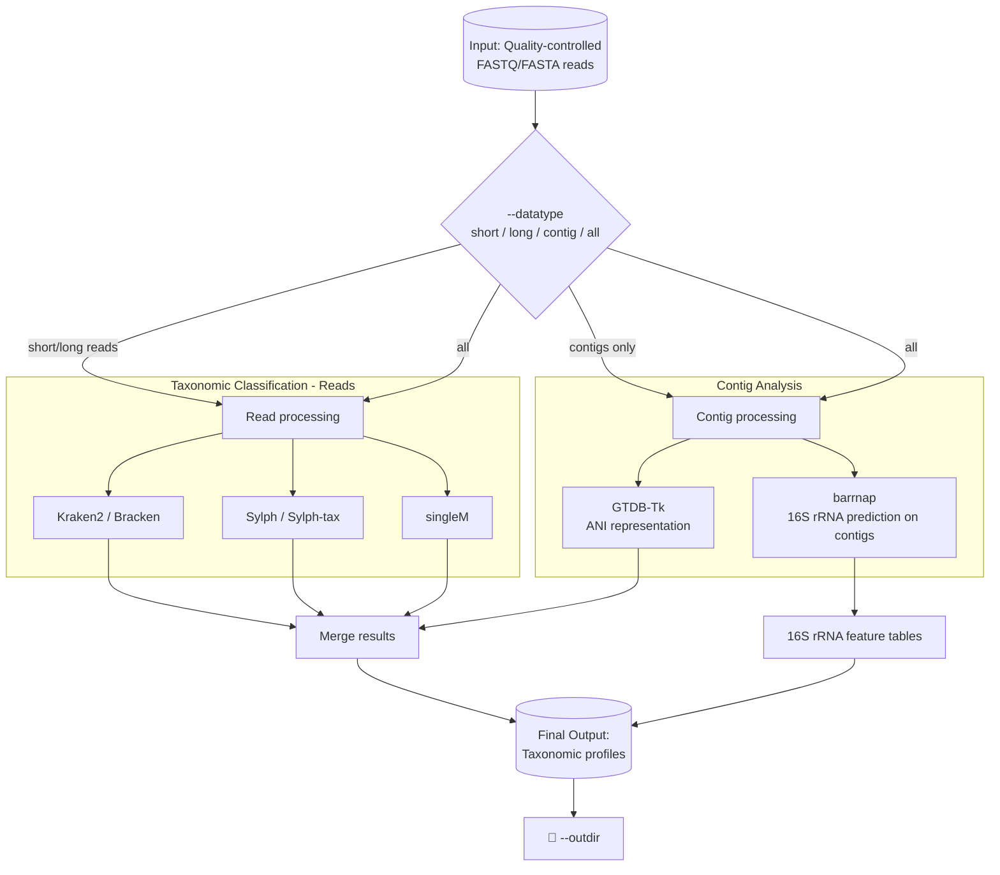

# nf-taxflow
> 🕒 **Last updated:** June 4, 2026

## Introduction

**nf-taxflow** is a bioinformatics pipeline designed for accurate taxonomic classification of pathogenic microorganisms from high-throughput sequencing reads or assembled contigs. Built with Nextflow,it enables portable and scalable execution across a range of computing environments. The use of Docker and Singularity containers ensures easy installation and highly reproducible results.

## Pipeline Summary
The pipeline takes a samplesheet and corresponding quality controlled FASTQ/FASTA files as input. It classified sequence reads with kraken2/bracken, sylph/sylphtax, and singleM. It can also classify assembled contigs with "gtdbtk ani_rep" 





## Pipeline required reference sequences and databases
1. [Kraken 2 / Bracken Database](https://benlangmead.github.io/aws-indexes/k2)
2. [Sylph Database](https://sylph-docs.github.io/pre%E2%80%90built-databases/)
3. [Sylph-tax Database](https://sylph-docs.github.io/sylph-tax/)
4. [singleM Database](https://wwood.github.io/singlem/tools/data)
5. [gtdb-tk database](https://ecogenomics.github.io/GTDBTk/installing/index.html)


## Quick Start
>If you are new to Nextflow and nf-core, please refer to [this page](https://nf-co.re/docs/usage/installation) on how to set-up Nextflow. Make sure to [test your setup](https://nf-co.re/docs/usage/introduction#how-to-run-a-pipeline) with -profile test before running the workflow on actual data.

### Check workflow options
You can clone or download the nf-taxflow from github to local computer or you can directly run the pipeline from github. To check the pipeline command line options:

```{r df-drop-ok, class.source="bg-success"}
# running directly from github without downloading or cloning
nextflow run xiaoli-dong/nf-taxflow -r revision_number(e.g:1000908) --help
```
### Prepare required samplesheet input
The nf-taxflow pipeline requires user to provide a csv format samplesheet, which contains the sequenence information for each of your samples, as input.  See below for what the samplesheet looks like:

`samplesheet.csv` for Illumina or nanopore reads analysis example
```
sample,fastq_1,fastq_2,long_fastq,fasta_contig
sample1,./inputdata/sample1.deacon_1.fastq.gz,./inputdata/sample1.deacon_2.fastq.gz,./inputdata/sample1.deacon.fastq.gz,./inputdata/sample1.contigs_final.fasta
sample2,./inputdata/sample2.deacon_1.fastq.gz,./inputdata/sample2.deacon_2.fastq.gz,./inputdata/sample2.deacon.fastq.gz,./inputdata/sample2.contigs_final.fasta

```

### Run the pipeline:
Now, you can run the pipeline using:

<!-- TODO nf-core: update the following command to include all required parameters for a minimal example -->

```bash

# Example command to run the pipeline from local download for sequence reads
nextflow run nf-taxflow/main.nf \
  -profile singularity \
  --input samplesheet.csv \
  --datatype short \
  --outdir results \
  -resume

# Example command to run the pipeline from local download for assembled contigs
nextflow run nf-taxflow/main.nf \
  -profile singularity \
  --input samplesheet.csv \
  --datatype contig \
  --outdir results \
  -resume

# Example command to run the pipeline from local download for all of the datatype of the sample: short|long|contig
nextflow run nf-taxflow/main.nf \
  -profile singularity \
  --input samplesheet.csv \
  --datatype all \
  --outdir results \
  -resume
```

>* Notes: Please provide pipeline parameters via the CLI or Nextflow `-params-file` option. Custom config files including those provided by the `-c` Nextflow option can be used to provide any configuration _**except for parameters**_; see [docs](https://nf-co.re/docs/usage/getting_started/configuration#custom-configuration-files).
